# Early data exploration


## Overview of the data
The data has already been divided into train and test sets so let's load them and get a sense of how the *train* data looks like. We'll also try to be very strict with the machine learning principles and not touch or even look at the *test* data until the end. 

Let's first get a sense of the train data.

```r
train <- read.csv("train.csv", na.strings = "")
str(train)
#> 'data.frame':	8693 obs. of  14 variables:
#>  $ PassengerId : chr  "0001_01" "0002_01" "0003_01" "0003_02" ...
#>  $ HomePlanet  : chr  "Europa" "Earth" "Europa" "Europa" ...
#>  $ CryoSleep   : chr  "False" "False" "False" "False" ...
#>  $ Cabin       : chr  "B/0/P" "F/0/S" "A/0/S" "A/0/S" ...
#>  $ Destination : chr  "TRAPPIST-1e" "TRAPPIST-1e" "TRAPPIST-1e" "TRAPPIST-1e" ...
#>  $ Age         : num  39 24 58 33 16 44 26 28 35 14 ...
#>  $ VIP         : chr  "False" "False" "True" "False" ...
#>  $ RoomService : num  0 109 43 0 303 0 42 0 0 0 ...
#>  $ FoodCourt   : num  0 9 3576 1283 70 ...
#>  $ ShoppingMall: num  0 25 0 371 151 0 3 0 17 0 ...
#>  $ Spa         : num  0 549 6715 3329 565 ...
#>  $ VRDeck      : num  0 44 49 193 2 0 0 NA 0 0 ...
#>  $ Name        : chr  "Maham Ofracculy" "Juanna Vines" "Altark Susent" "Solam Susent" ...
#>  $ Transported : chr  "False" "True" "False" "False" ...
```

There are 8693 observations and 14 variables where "Transported" is the target variable. The specifics on the different variables are explained in detail on the competition website so I won't repeat them here. It's enough to note that there is a mix of categorical and continuous variables and that our target variable is expressed as True/False in a character vector.

## Do some variables have zero or near-zero variance?
One of the first things that might be useful to check is whether any of the variables have zero or near-zero variance. A zero variance variable is one where all rows have the same value (imagine a variable where all rows are just the number 1). Such variables are not useful for prediction since they don't change regardless of how the target variable changes.

Their close cousin are the near-zero variances where a high percentage of the rows have the same value but some don't. This can be particularly problematic when we want to do repeated cross validation where we divide the data into subdata to test our models. Some of these subdata might then have zero variance while other subdata might get a high variance for the same variable. 

```r
nearZeroVar(train, saveMetrics = TRUE) %>% rownames_to_column() %>% filter(nzv)
#>   rowname freqRatio percentUnique zeroVar  nzv
#> 1     VIP  41.66332    0.02300702   FALSE TRUE
```

Only the VIP variable has near-zero variation (2.3% of all rows). We'll deal with this later.

## Frequency distribution of all variables
Let's see how the values of the different variables are distributed.

```r
plot_frq(train, Transported)
```

<div class="figure">
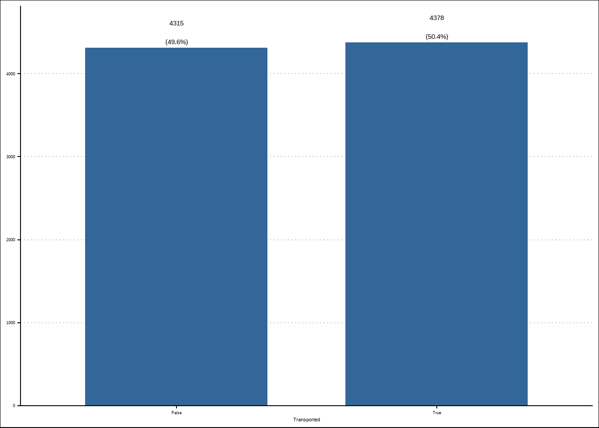
<p class="caption">(\#fig:frequencies-1)Distribution of the variables against the response</p>
</div>

```r
plot_frq(train, -Transported, type = "histogram")
```

<div class="figure">
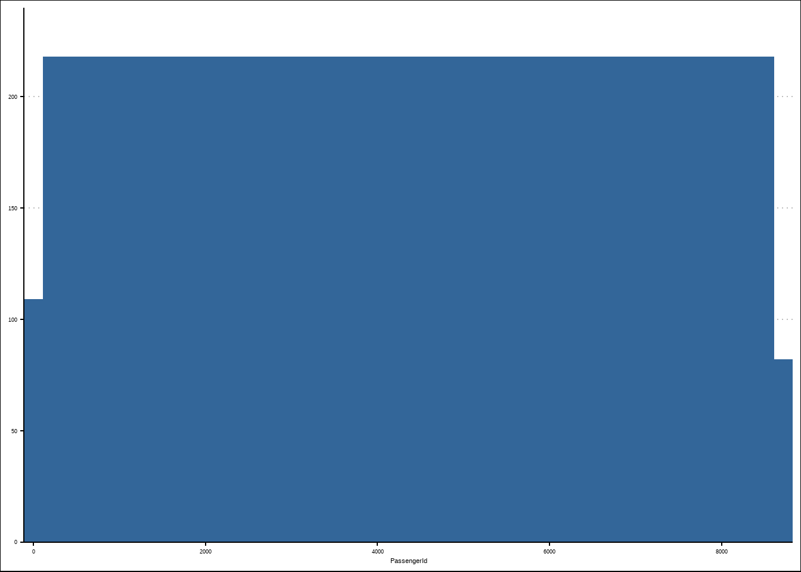
<p class="caption">(\#fig:frequencies-2)Distribution of the variables against the response</p>
</div><div class="figure">
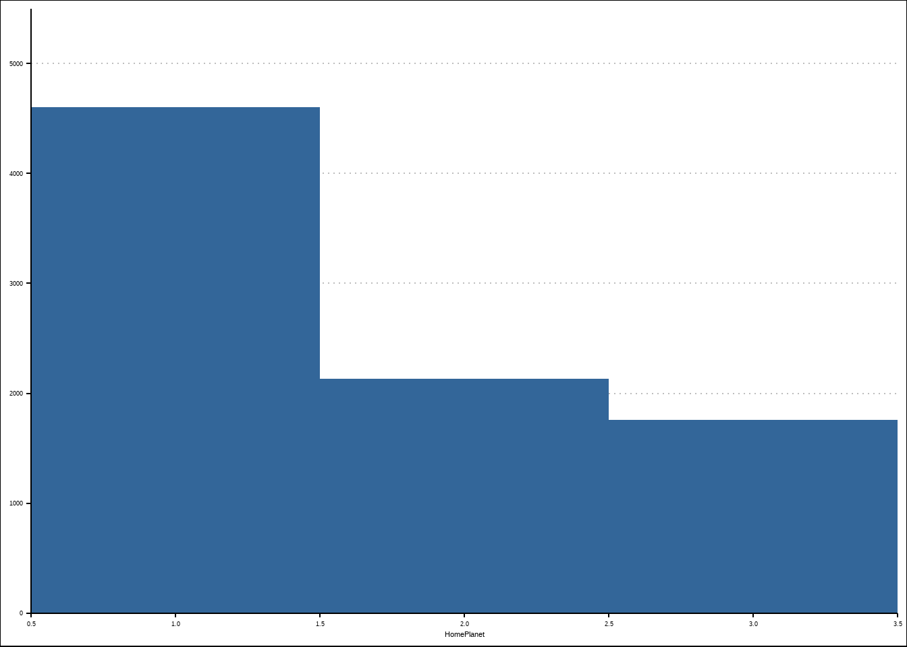
<p class="caption">(\#fig:frequencies-3)Distribution of the variables against the response</p>
</div><div class="figure">
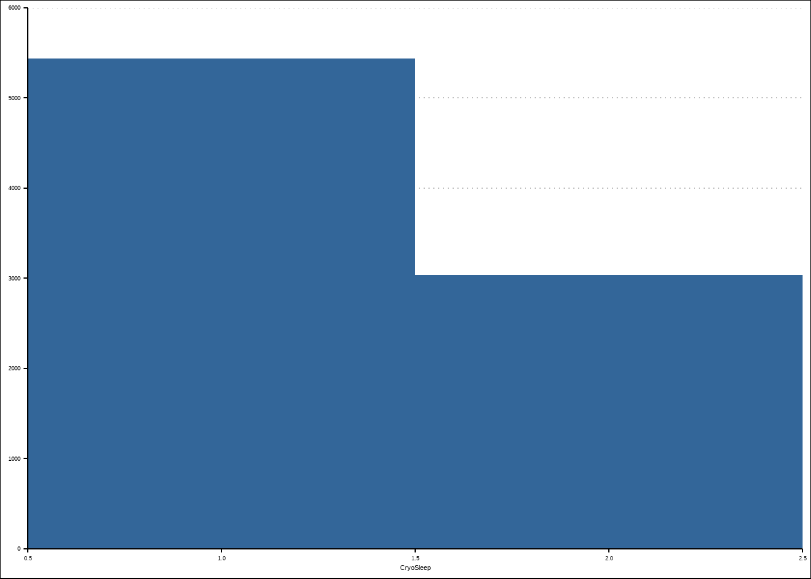
<p class="caption">(\#fig:frequencies-4)Distribution of the variables against the response</p>
</div><div class="figure">
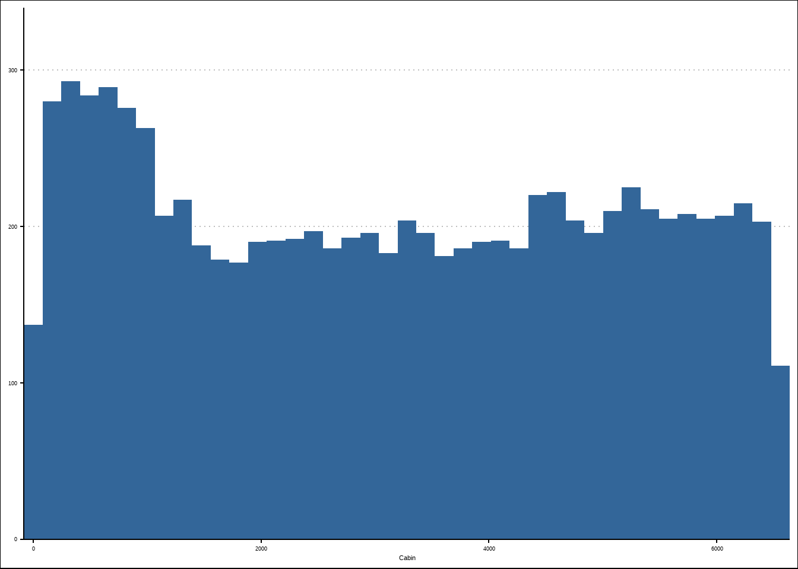
<p class="caption">(\#fig:frequencies-5)Distribution of the variables against the response</p>
</div><div class="figure">
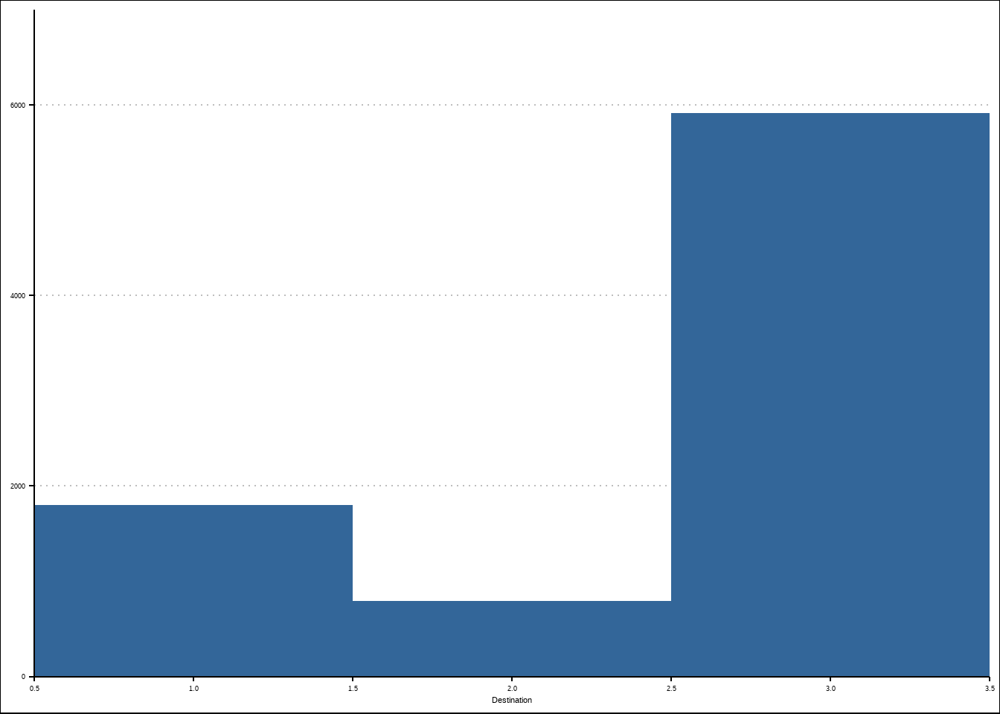
<p class="caption">(\#fig:frequencies-6)Distribution of the variables against the response</p>
</div><div class="figure">
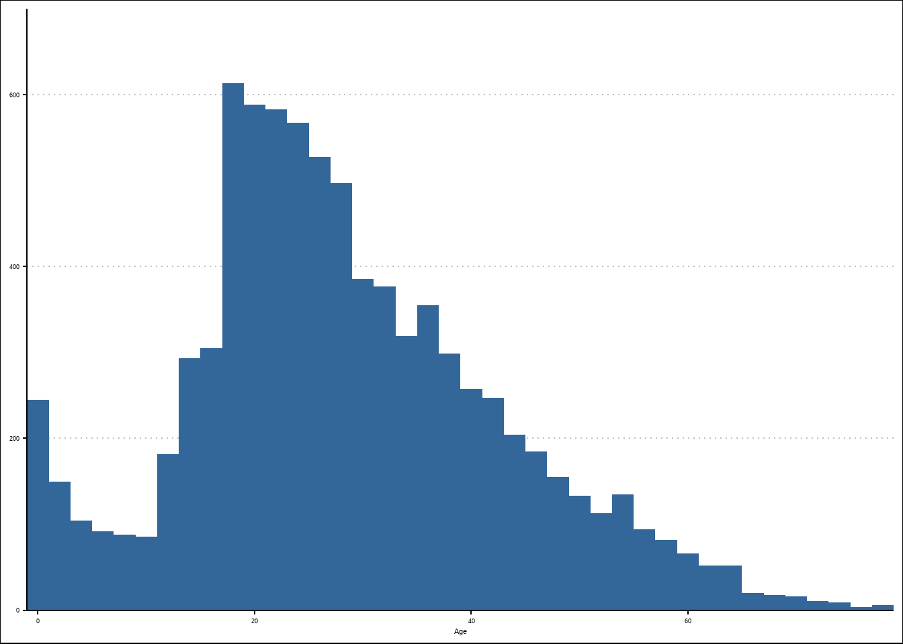
<p class="caption">(\#fig:frequencies-7)Distribution of the variables against the response</p>
</div><div class="figure">
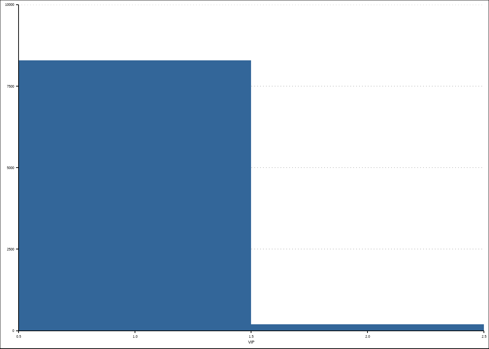
<p class="caption">(\#fig:frequencies-8)Distribution of the variables against the response</p>
</div><div class="figure">
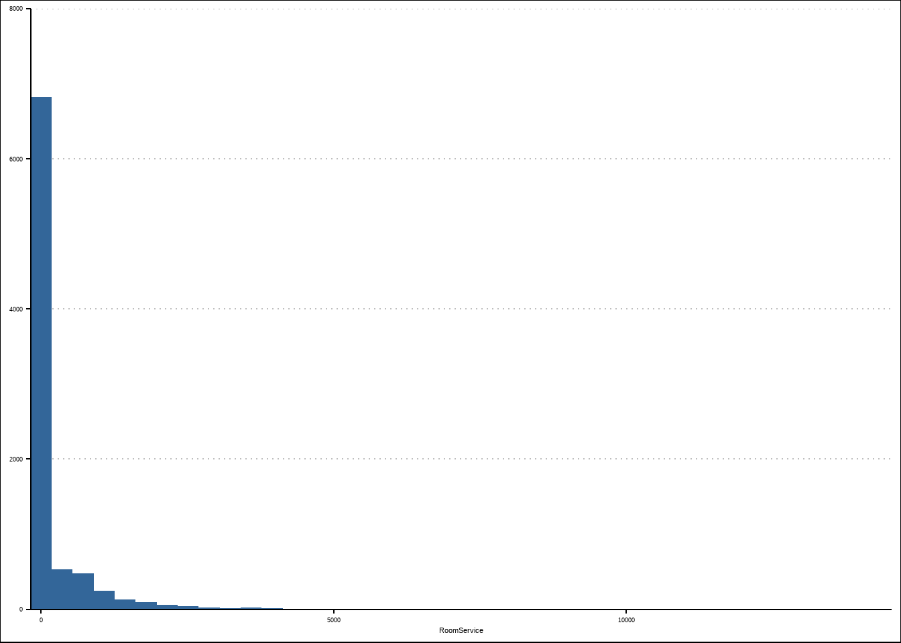
<p class="caption">(\#fig:frequencies-9)Distribution of the variables against the response</p>
</div><div class="figure">

<p class="caption">(\#fig:frequencies-10)Distribution of the variables against the response</p>
</div><div class="figure">
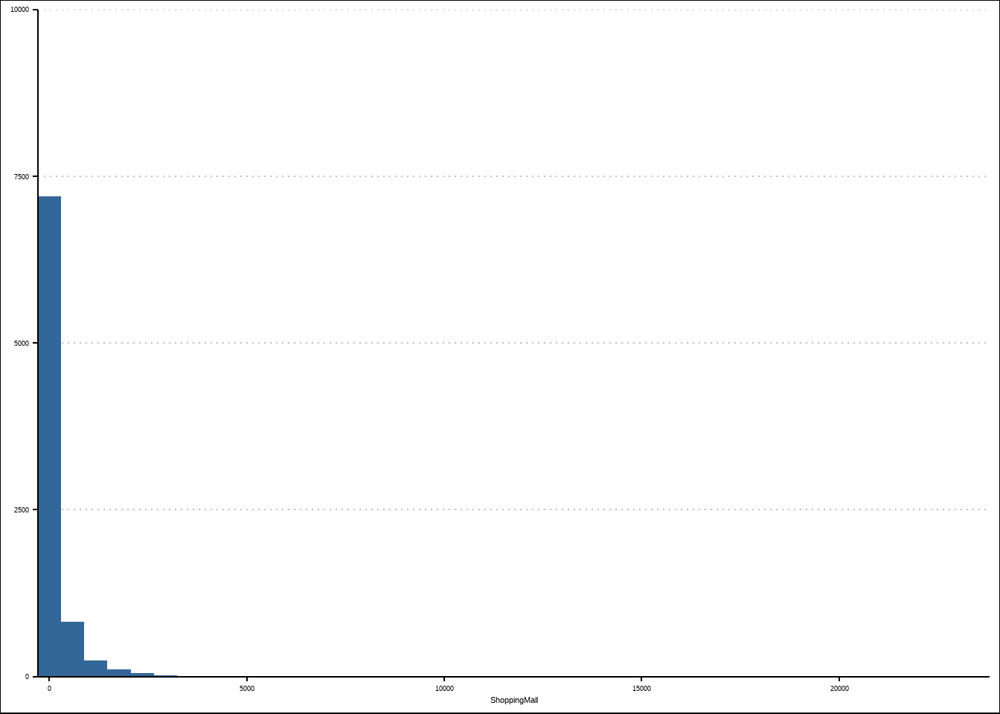
<p class="caption">(\#fig:frequencies-11)Distribution of the variables against the response</p>
</div><div class="figure">
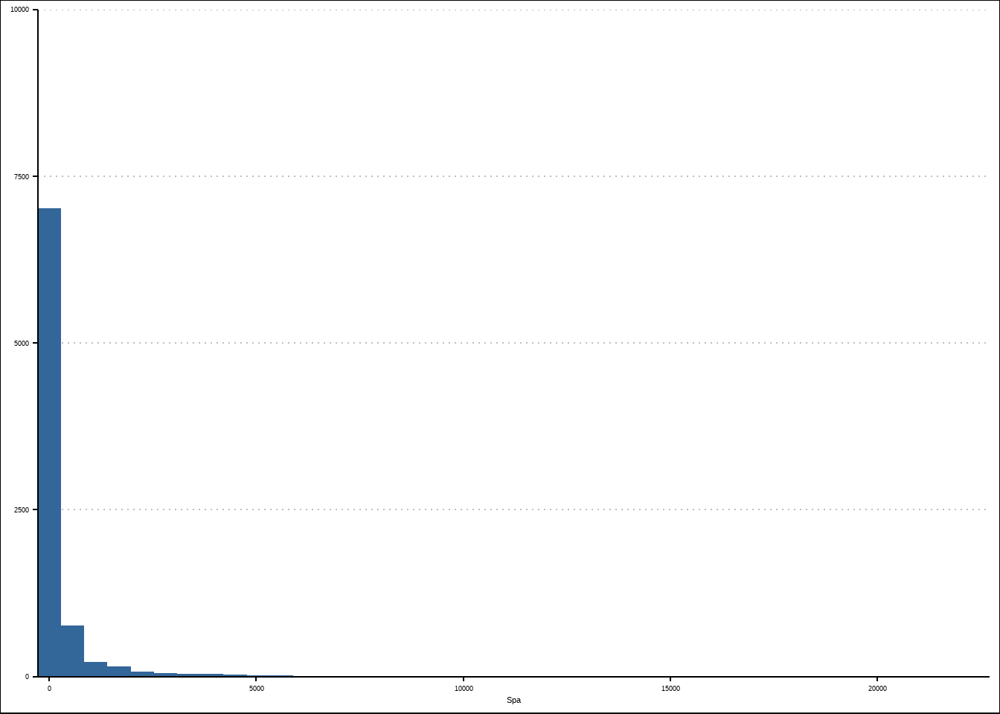
<p class="caption">(\#fig:frequencies-12)Distribution of the variables against the response</p>
</div><div class="figure">

<p class="caption">(\#fig:frequencies-13)Distribution of the variables against the response</p>
</div><div class="figure">
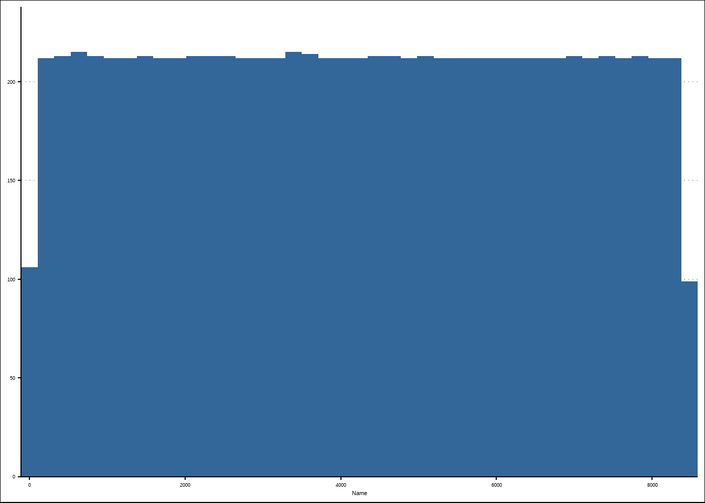
<p class="caption">(\#fig:frequencies-14)Distribution of the variables against the response</p>
</div>

The target variable is balanced which is preferable. An unbalanced distribution of the target variable (meaning that the share of one outcome vastly outweighs the other) can skew the predictive results of some algorithms. Fortunately, we do not have to apply any resampling or downsampling methods to balance it.

The numeric variables are right-skewed, meaning they have outliers to the right of the horizontal axis and the amenities (RoomService, FoodCourt etc) have a high proportion of zero values. The difference in scales is also large. We will need to apply some kind of preproces to scale them to help out models like K-nearest-neighbors (KNN). We might also need to add binary features (yes/no or 1/0) for the amenities that are zero.

The Cabin and Name variables have a near uniform distribution which implies that they either won't have much predictive power by themselves or could even reduce the accuracy by introducing unnecessary noise to the model. We will either have to derive features from these variables or not include them in the models.

## Correlation between the variables

```r
train %>%
  na.omit(.) %>%
plot_correlation(., type = "all",
                 geom_text_args = list(size = 2),
                 theme_config = list(axis.text.x = element_text(angle = 90)))
#> 3 features with more than 20 categories ignored!
#> PassengerId: 6606 categories
#> Cabin: 5305 categories
#> Name: 6590 categories
```

<div class="figure">
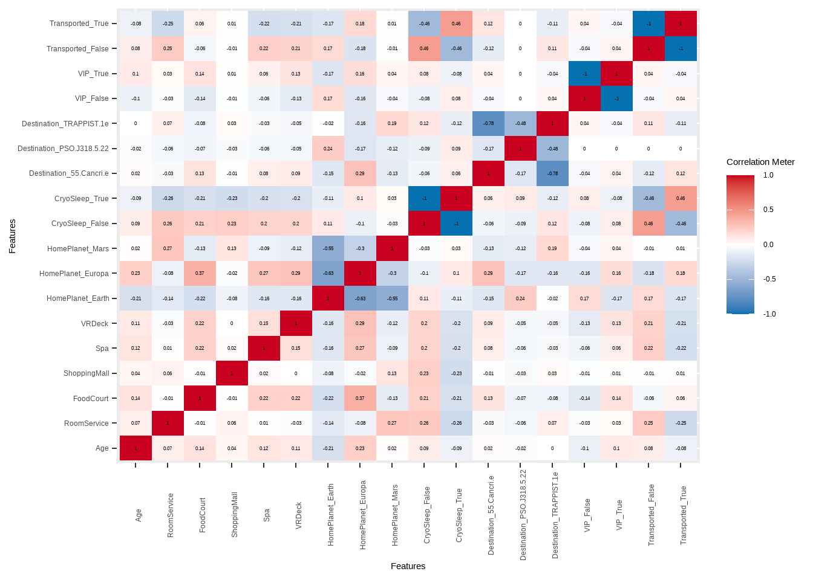
<p class="caption">(\#fig:correlation)Correlation between numerical variables</p>
</div>

We see that there's some relatively high correlation between homeplanets and destinations as well as a moderate correlation between CryoSleep and Transported which already gives us a hint that CryoSleep might be important. Otherwise, the cariables seem relatively uncorrelated which is a good thing since some models cannot handle variables that are too correlated.

## Overview of missing values

```r
plot_na_hclust(train)
```

<div class="figure">
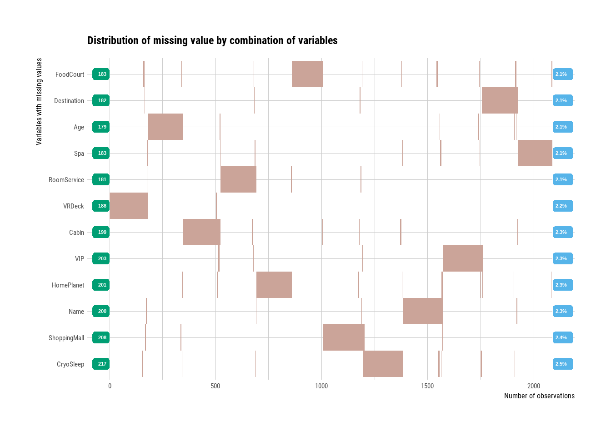
<p class="caption">(\#fig:missing)Missing values overview</p>
</div>

All predictor variables are missing to the amount of 2% which is relatively low. When we cluster the missing values, we can also see that most don't overlap which suggests that they're missing at random and not due to some specific pattern. This tells us that we can probably find a suitable algorithm to help us impute the missing values based on the non-missing values. Had there been a pattern or clusters of missing data, we'd have to explore further to uncover the reasons for such non-random missingness.
